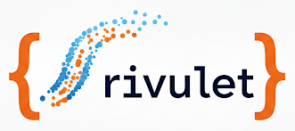

# Rivulet: Python Notebook Utilities for Curating Pedagogically Useful Datasets

A collection of Jupyter notebooks to help educators and educational designers find 
and download pedagogically useful subsets of data from large, public data streams. 
The notebooks emphasize finding datasets with complex patterns that can be explored 
using agent-based models.

## About Rivulet

These utilities are designed for educators who want to use fresh, relevant data in 
classrooms but may find searching large public data streams overwhelming. Rivulet 
helps you access and assess subsets of data that are local, timely, or otherwise 
relevant to your students. Importantly, it does this in a way that also centers 
pedagogical utility by selecting for key statistical and/or scientific characteristics 
of datasets that are known to be pedagogically generative, depending on the topic. 
Along the way, the notebooks gently introduce general techniques and skills related 
to fetching data using APIs and Python. 

The name *Rivulet*—a small stream—refers to the goal of curating manageable, dynamic 
samples from larger data streams. It's also a nod to Tim Erickson's idea of being 
[Awash in Data](https://codap.xyz/awash/), and an acknowledgement that while there 
are some powerful [Oceans of Data](https://oceansofdata.org/) out there, finding 
one that's manageable, interesting, and ready to use can be difficult or even 
overwhelming.

## Target Audience

These tools are designed for advanced beginners to intermediate Python users. If 
you're an educator or designer who is comfortable with Python and wants to find 
compelling datasets without starting from scratch, Rivulet is for you.

## Questions and Contributions

Have questions or ideas? Please open an issue or feel free to reach out to 
Michelle Wilkerson (@michellehoda) here on GitHub.
